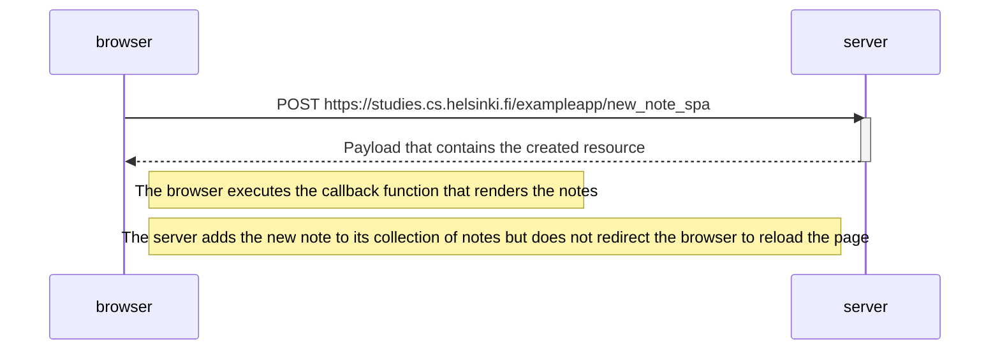

```mermaid
sequenceDiagram
participant browser
participant server

    browser->>server: POST https://studies.cs.helsinki.fi/exampleapp/new_note_spa
    activate server
    server-->>browser: Payload that contains the created resource
    deactivate server

    Note right of browser: The browser executes the callback function that renders the notes
    Note left of server: The server adds the new note to its collection of notes but does not redirect the browser to reload the page
```
